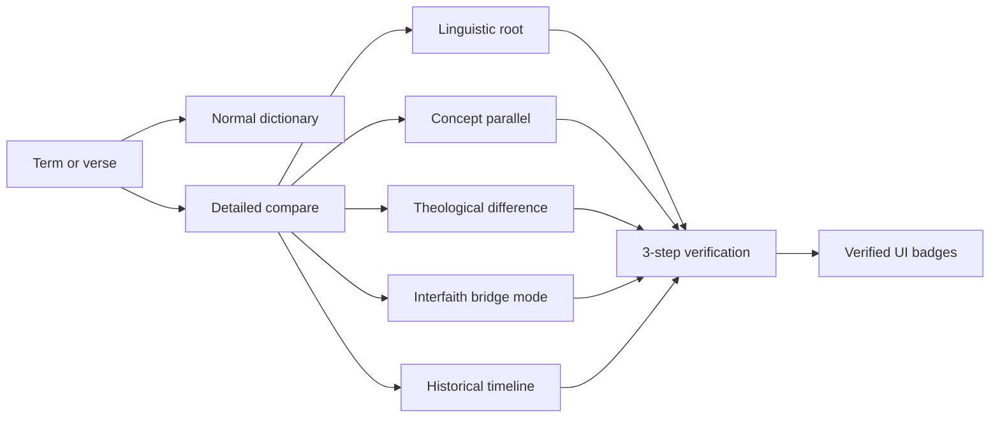
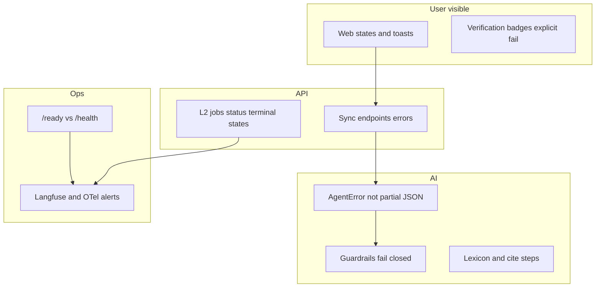
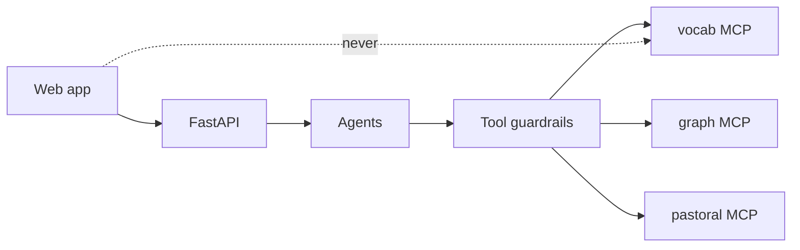
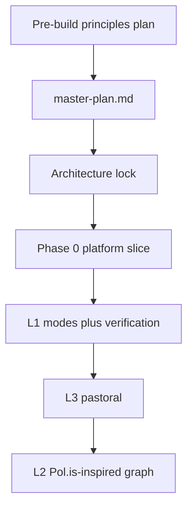

# Pre-build plan — L1/L2 positioning, Pol.is, verification, and engineering rules

**Status:** Saved in repo. Product principles before Phase 0 — split docs and code still pending.

**Relationship to existing repo:** Your architecture flow ([`docs/architecture.md`](docs/architecture.md)) stays the same. This plan **extends** what L1/L2 *mean* in product terms and what must be designed **before** Phase 0 implementation. ADR-005 remains a stored ADR only until L3. The pastor-layer workflow is [`docs/l3-pastor-pipeline.md`](../../docs/l3-pastor-pipeline.md).

---

## 1. What we are not building

| Reference apps (study only) | Why we are different |
|---|---|
| Religions Ocean 2.9, Interfaith Reader, Open Religion Guide, FaithGPT, Faith Explorer–style chat | They skew toward **single-tradition or conversational RAG** — not a **structured, interactive comparative engine** with verification |
| “One more AI Bible / faith chat” | We ship **modes** (lexicon → parallel → difference → bridge → timeline), **citations**, and **verified UI** — not open-ended persuasion chat |

**Positioning one-liner:** An interactive, pedagogical comparative vocabulary system (L1) plus longitudinal **concept** belief mapping (L2) plus pastor accountability (L3) — grounded, distinct traditions, no false equivalence.

---

## 2. L1 — Interactive comparative engine (product design)

Extend today’s [`compare.output.json`](schemas/compare.output.json) (Hindu / Buddhist / Christian sections + `bridge_summary`) into explicit **modes** the UI and API expose:

| Mode | Purpose | Distinction / anti-syncretism |
|---|---|---|
| **Linguistic root** | Etymology / original-language anchors (Sanskrit, Pali, Hebrew/Greek where licensed) | Same word ≠ same concept — state that explicitly |
| **Concept parallel** | Where ideas *resemble* across traditions | Label as *analogy*, not identity |
| **Theological difference** | Where doctrines diverge | No strawmen; cite sources; no ranking “winner” |
| **Interfaith bridge** | Shared moral, ethical, meditative common ground | Bridge ≠ merge; optional Christian framing in separate field, not blended prose |
| **Historical timeline** | How usage/concepts shifted over time | Reduces anachronism and translation distortion |

**Principles (non-negotiable for prompts, guardrails, evals):**

- Avoid **over-syncretism**; maintain **tradition distinction**
- **Original-language grounding** where corpus supports it ([`data-ethics.md`](docs/data-ethics.md) licensing)
- Avoid **proselytization tone** and **conversational bias** in L1 copy; avoid **translation distortion** (multiple translations + license metadata)
- Respect **lexicon depth** — admit `coverage: insufficient` ([`compare.output.json`](schemas/compare.output.json)) instead of inventing

**Hackathon / Christian context:** The public dictionary stays a definition. Faith mode is the Christian explanation. It may teach clearly. It does not force the traditions to be the same, and it is not an argumentative debate UI ([`OUT-TONE`](docs/guardrails.md)).

**Faith mode core.** The bridge names two gaps:

- **Ultimate goal.** Nirvana or moksha works by detachment and the extinction of individual identity into a universal oneness. Christian salvation keeps a unique identity for an eternal, personal relationship with God (heaven, the kingdom of God). The gap is loss of personhood versus the perfection of personhood.
- **Problem of humanity.** Where the root problem is ignorance or forgetfulness, the remedy is education, law, or enlightenment. Christianity names sin: a broken relationship and a dead spiritual nature. A person needs a Savior who brings them from death to life, not only a teacher or a rule list.

Parallel stays an analogy. Difference does not rank a winner.

**Demo concepts for Faith mode:** marriage, love, faith, and salvation. The ten-term dictionary seed is a separate list and is not replaced by these four.

**Expert review (planning only).** A religion expert may make, change, or suggest on one area of a term: parallel, difference, Christian bridge, linguistic root, or historical timeline. Each action is logged with who the person is, the term, the area, the action, and the previous text beside the new text. A suggestion waits. A make or a change is the expert’s edit and stays in the log. This is Faith-mode content review, not the pastor queue in ADR-005. Routes are reserved in `docs/api.md` and are not implemented.

**Before code — doc/schema work (later ACT):**

- New product doc: `docs/l1-comparative-modes.md` (modes, copy rules, evangelism boundary)
- Extend API: `POST /api/l1/compare` request with `mode` enum (or separate endpoints — decide in architecture-lock)
- Extend `compare.output.json` + eval checks: `no_false_equivalence`, `no_strawman`, `original_language_when_available`
- Seed corpus: terms + timeline snippets + licensed source chunks per tradition

---

## 3. L2 — Adapt working concepts from Pol.is (not a clone)

From [`references`](../references) and [`build-plan.md`](docs/build-plan.md) pitch defense:

**Borrow from Pol.is (pol.is):**

| Pol.is concept | Adapt for Church AI L2 |
|---|---|
| Open question + many free-text responses | Monthly `l2_question` + anonymous `l2_response` (already in [`data-model.md`](docs/data-model.md)) |
| Participants see **where they align / diverge** | Admin (and optionally public read-only) view: **concept clusters** and co-occurrence, not “you are in group 3” |
| Consensus vs disagreement visual language | Graph UI: dense edges = co-mentioned concepts; separate “consensus concepts” vs “polarized pairs” in `stats` |
| Moderation / toxicity handling | IN-INJ on responses; flagged count in [`graph.output.json`](schemas/graph.output.json) `stats.flagged_inputs` |
| Repeat participation over time | **Monthly snapshots** (`new_concepts_vs_previous`) — your differentiator vs Pol.is point-in-time k-means |

**Do not copy:**

- Pol.is **people clustering** (k-means on voters) as the primary artifact — you store a **concept graph** (nodes/edges), not “5 opinion groups of users”
- AGPL Pol.is codebase fork — use ideas + your Graph Builder agent + Memgraph

**Optional Pol.is-inspired UX (public L2 submit flow):**

- After submit: “Others also talked about…” (aggregate concepts only, no quotes that re-identify)
- Admin: force-directed graph ([`references`](../references) — Cytoscape / react-force-graph)

**Later alignment with ADR-005:** L2 snapshots **draft → admin publish** (already in ADR-005; apply when you reach L2 build).

**Reach (planning only, not built).** The graph radius is open by default. Someone far away can still share a view, and it is noted on the concept map. Responses stay anonymous: no user id, no IP, no GPS ([`data-model.md`](docs/data-model.md) `l2_response`). If abuse, safety, noise, or an unreadable map becomes a problem, a coarse limit can be turned on (a region for new answers, or a cap on outlying concepts). The limit hides or narrows what is drawn. It does not erase the far view from the record.

**Before code — doc work (later ACT):**

- `docs/l2-polis-adaptation.md` — table above + wireframes notes
- Extend `graph.output.json` if needed: `consensus_nodes[]`, `polarized_pairs[]` (optional fields)
- Eval cases: injection in responses ignored; graph does not leak individual text in public API

---

## 4. Verification strategy — yes, **lean (layered) verification** fits this system

**Recommendation:** Use **lean verification** in the sense of *minimal, staged, fail-visible checks* — **not** the [Lean theorem prover](https://lean-lang.org/) for v1. Formal proof of theological claims does not scale for a hackathon web+AI product and cannot replace human + source grounding for interfaith content.

**Why lean layered verification matches Church AI:**

| Property | Why it fits |
|---|---|
| LLM is non-deterministic | Deterministic steps (lexicon, citation match) anchor truth; LLM judge is last, not first |
| You promise citations + distinction | Steps 1–2 are cheap and demo-friendly (“Verified” badges) |
| Judges / pastors need trust | Explicit failure reasons beat black-box “AI said so” |
| Cost & latency | Full LLM-judge on every lookup is expensive — run step 3 on detailed modes, sampled in CI, or when step 2 fails |
| L3 is sensitive | Lean pipeline for **L1**; L3 adds **human review (ADR-005)** — AI never sole authority |

**What lean verification is NOT (avoid):**

- Silent pass when corpus missing (`coverage: insufficient` is required)
- LLM-only “verification” with no retrieved quote check
- Formal Lean proofs of doctrine (future research, not MVP)

**Tier model (plan):**

| Tier | When | Steps |
|---|---|---|
| **T0 — Public L1 normal** | Dictionary lookup | Lexicon only; no LLM |
| **T1 — L1 detailed / modes** | Compare agent | Step 1 + 2 mandatory; Step 3 in CI + optional runtime for demo |
| **T2 — L2 graph labels** | Graph builder | Injection flags + admin publish (ADR-005); no public “verified” on concepts without publish |
| **T3 — L3 check-in** | Check-in analyst | Guardrails + crisis eval 100%; **human review** for non-stable; not “verified UI” for risk labels |

**Lean prover (optional future):** Only consider for **mechanical** invariants (JSON schema, API state machines, idempotency keys) — same job as Pydantic + tests today, not for “is this theology correct.”

---

## 4b. Three-step verification pipeline (L1 primary; reusable for L2 labels)

Maps to existing guardrails but adds **deterministic** step and **verified UI**:

| Step | Mechanism | On failure |
|---|---|---|
| **1 — Deterministic lexicon** | Term must exist in curated lexicon / allowlist; optional original-language key; block unknown terms from “full coverage” claims | User-visible: “Term not in verified lexicon” + suggest nearby terms |
| **2 — Exact scripture / source quote cross-check** | Retrieved chunk text must **contain** or **match** cited reference; OUT-CITE already in [`guardrails.md`](docs/guardrails.md) | Retry once → `coverage: insufficient`; show which tradition failed verification |
| **3 — LLM judge (doctrinal + tone audit)** | Offline eval + optional runtime judge: no false equivalence, no strawman, respectful tone ([`tone_neutral`](docs/evals.md)) | Fail closed for publish: no “Verified” badge; show “Review pending” |

**Verified UI (web):**

- Badges per section: Lexicon ✓ / Citation ✓ / Tone audit ✓ (or explicit failure reason — **never silent**)
- Store verification result on lookup log for demo analytics

**Before code:**

- Add eval checks + thresholds in `docs/evals.md` (plan content)
- Implement in `packages/guardrails` + compare agent output extension (implementation phase)

---

## 5. Engineering rules (whole system)

These apply from **Phase 0** onward and should appear in `.cursor/rules/web.mdc` / `api.mdc` when you ACT:

| Rule | Rationale |
|---|---|
| **No silent failures** | Every API/agent error returns structured `{ error: { code, message, request_id } }` ([`api.md`](docs/api.md)); UI shows toast/banner + retry |
| **No secrets in client** | Only `SUPABASE_ANON_KEY` and public URLs in Next.js; never service role, LLM keys, JWT secrets ([`.env.example`](.env.example)) |
| **No frankenstein UI state** | Single source of truth per screen (React Query / server components pattern); no duplicated compare result in unrelated stores; mode switches reset or version state explicitly |
| **Role enforcement server-side** | Pastor/admin only via API + MCP TL-PERM — not client-only checks |

### 5a. Anti–silent-failure checklist (whole system)

Silent failure = user or operator **believes something succeeded** when it did not, or **sees nothing** when something broke. Address every layer:

| Layer | Silent failure risk | What to do |
|---|---|---|
| **Web UI** | Spinner forever; empty screen; stale “verified” | Required states per [`web.mdc`](.cursor/rules/web.mdc): loading, empty, error, **AI unavailable** (feature flag off). Timeouts → error + retry. Show **which** verification step failed, not a generic OK. |
| **API sync** | 200 with empty body; swallowed exceptions | Always JSON; errors use `error.code` (e.g. `AGENT_FAILED`, `QUOTA_EXCEEDED`, `VERIFICATION_FAILED`). Propagate `request_id` to UI for support. Never return unvalidated model prose. [`api.mdc`](.cursor/rules/api.mdc) |
| **API async (L2 jobs)** | Job stuck in `running` forever | Terminal states: `succeeded`, `failed`, `cancelled` with `failure_reason`. Poll UI shows failure; admin can retry. Alert on queue depth / stale jobs ([`observability.md`](docs/observability.md)). |
| **Agents** | Partial/guessed JSON after schema fail | One retry with validation error → **`AgentError`** to API — never best-effort fill ([`agents.mdc`](.cursor/rules/agents.mdc)). |
| **LLM gateway** | Guardrail check throws → skip and call model | **Fail closed** ([`guardrails.mdc`](docs/guardrails.md)). Log guardrail id + action; user gets safe message. |
| **L1 verification** | `coverage: insufficient` shown as full answer | UI: “Not in verified lexicon” / “Citation check failed” / “Tone review pending”. Never badge **Verified** on fail. |
| **L3 check-in** | Analysis fails but pastor thinks AI reviewed | `POST /api/l3/checkins` response: `analysis_status` = `pending` \| `complete` \| `failed` \| `requires_review`. Pastor sees encouragement only when policy allows (stable + reviewed per ADR-005). **Crisis: never block silently** ([`guardrails.md` IN-SAFE](docs/guardrails.md)). |
| **L3 human review** | Escalation acked but review still open | ADR-005: ack **does not** close review queue — UI must show both states. |
| **MCP tools** | Tool error → agent hallucinates data | Tool returns typed error to agent; agent must not invent DB rows. Tool guardrails log `ok/err` on traces ([`observability.md`](docs/observability.md)). |
| **Auth / quota** | 401/403 as empty 200 | Fail with clear codes; public L1 quota exceeded → user-visible message, not infinite spin. |
| **Feature flags** | AI broken but UI still calls API | When `FF_*` false: **AI unavailable** state, not hidden errors. Demo mode: `FF_SERVE_CACHED_DEMO_RESPONSES` must be obvious in admin if enabled. |
| **Deploy / infra** | App up but DB down | `/health` ≠ `/ready`. Load balancer uses `/ready`. Free-tier spin-down: web shows “service waking up” not blank ([Render ephemeral/spin-down](https://render.com/docs/free)). |
| **Observability** | Production broken, no one knows | Alert: schema-failure rate, error rate, unacked escalations, budget 80%, `/ready` fail ([`observability.md`](docs/observability.md)). Every block/fail has `request_id` in logs. |
| **Client errors** | Unhandled promise → white screen | Error boundary on app shell; fetch wrapper maps API errors to toasts. |
| **Offline / network** | Check-in “saved” but not synced | Reserved for Android later; web: fail visibly if submit fails. |

**Standard error codes (plan — add to `docs/api.md` on ACT):**

`VALIDATION_ERROR`, `UNAUTHORIZED`, `FORBIDDEN`, `QUOTA_EXCEEDED`, `RATE_LIMITED`, `AGENT_FAILED`, `VERIFICATION_FAILED`, `GUARDRAIL_BLOCKED`, `JOB_FAILED`, `SERVICE_UNAVAILABLE`, `NOT_READY`.

**Testing silent failures:**

- Contract tests: every agent failure path returns `AgentError` → API error JSON.
- E2E: throttle LLM to timeout → UI shows error, not infinite load.
- `requires_review` / crisis cases: never empty pastor response without explanation.
- CI: guardrail unit test “checker throws → block, not pass-through.”

**Doc on ACT:** `docs/error-handling.md` (user-visible + operator runbook) linked from README.

---

## 5b. MCP security (reference: Damn Vulnerable MCP Server)

**Reference (education only, not a dependency):**

- Lab: [harishsg993010/damn-vulnerable-MCP-server](https://github.com/harishsg993010/damn-vulnerable-MCP-server) (DVMCP) — 10 deliberate MCP vulnerabilities for training.
- Mitigations pattern: [Solution guides index](https://github.com/harishsg993010/damn-vulnerable-MCP-server/blob/main/solutions/README.md) (challenges 1–10).

**How we use it:** Run DVMCP in Docker **locally** during MCP implementation and before demo — same mindset as `redteam` + `guardrail-audit`. **Never** deploy DVMCP or copy vulnerable patterns into `packages/mcp/*`.

**Architecture constraint (unchanged):** Agents never touch DBs directly; all data access goes through the three MCP servers behind **tool guardrails** ([`architecture.md`](docs/architecture.md)). MCP servers are **server-side only** — not exposed to the Next.js browser.

### DVMCP challenge → our mitigation map

| # | DVMCP theme | Risk for Church AI | Mitigation (design + verify) | Already in repo |
|---|---|---|---|---|
| 1 | Basic prompt injection | User/L2/L3 text steers agent | IN-INJ, untrusted envelope, intake scope | [`guardrails.md`](docs/guardrails.md), `redteam` #1 |
| 2 | Tool poisoning | Hidden instructions in tool **descriptions** | Short factual descriptions only; no “always do X”; review in PR; version tools | [`.cursor/rules/mcp-servers.mdc`](.cursor/rules/mcp-servers.mdc) |
| 3 | Excessive permission scope | Pastor tool reads all check-ins | Per-tool role matrix; pastoral scoped by `caller_id`; graph write = system/admin only | [`architecture.md`](docs/architecture.md) MCP table, TL-PERM |
| 4 | Rug pull | Tool behavior changes after deploy | Pin tool name + JSON schema in git; CI diff on `packages/mcp/**`; agent allowlist frozen per release | **Add:** `docs/mcp-security.md` + CI check |
| 5 | Tool shadowing | Duplicate tool names override legit tools | Fixed namespaces: `vocab.*`, `graph.*`, `pastoral.*`; agents call allowlisted names only | **Add:** explicit allowlist in agent config |
| 6 | Indirect prompt injection | L2 responses / RAG chunks / tool output contain instructions | TL-SANITISE, cap length, flag instruction-like text; envelope on tool results | `redteam` #2, guardrails TL-SANITISE |
| 7 | Token theft | MCP or API tokens in client / logs | Secrets env-only; MCP on private network; no tokens in tool responses or traces | threat-model secrets row, CI gitleaks |
| 8 | Malicious code execution | Tools that shell out or eval | **No** generic “run code” tools; SQL/ Cypher parameterized; read-only graph fetch limits | **Add:** MCP tool review checklist |
| 9 | Remote access control | Command injection via tool params | Strict JSON schema + bounds (`days≤14`, `k≤8`); reject unknown fields | TL-SCHEMA in guardrails |
| 10 | Multi-vector | Chain injection + over-permissive tool | `redteam` + optional DVMCP lab rehearsal; release gate 100% | [`redteam` SKILL](.cursor/skills/redteam/SKILL.md) |

### MCP deployment rules (plan — encode in `docs/mcp-security.md` on ACT)

- **Network:** MCP processes listen on internal host/port only; API is the public edge. Render/Linux: case-sensitive paths, bind `0.0.0.0:$PORT` for API only.
- **Auth to MCP:** Service identity from API → MCP (mTLS or signed internal JWT); **never** forward browser session to MCP as sole proof for L3 reads.
- **Tool registry:** Single source of truth per server; changes require PR + `guardrail-audit` + `new-mcp-tool` skill checklist.
- **Observability:** Log tool name, role, latency — not full L3 payloads (masked); Langfuse tool spans without raw check-in text.
- **Failure visibility:** Tool errors return typed errors to agent → API → UI (aligns with **no silent failures**).

### Extend `redteam` / `threat-model.md` (on ACT)

Add threat-model rows for: tool poisoning, rug pull, tool shadowing, MCP token exposure.

Add redteam suites **10–13** (MCP-focused):

- Poisoned tool description in a **test double** server (ensure production descriptions are scanned in CI for instruction phrases).
- Indirect injection via `search_sources` returning adversarial chunk text.
- Cross-pastor ID in `get_checkin_history` params (must 403).
- Attempt to register a second tool named `pastoral.get_checkin_history` with broader scope (allowlist rejects).

### Optional ADR-007 (later)

“MCP trust boundary and internal auth” — document Railway/Render service layout and why MCP is not client-facing.

---

## 6. Recommended planning sequence (before any code)

1. **This plan** — you review and refine (current step).
2. **Optional:** Capture L1 modes + verification in a short ADR-006 “Comparative pedagogy and verification” (when you ACT).
3. **Run** [`.cursor/plan-prompts/01-master-plan.md`](.cursor/plan-prompts/01-master-plan.md) with placeholders filled: team size, timeline, and **paste Section 2–4 of this plan** into context.
4. **Run** `02-architecture-lock.md` — lock `mode` API shape, verification storage, L2 public vs admin graph views, **MCP internal auth and network boundary**.
5. **Then** Phase 0 scaffold (monorepo, health, gateway stubs, **tool-guardrail wrapper stub** that every MCP call must pass).

Note: [`gstack-workflow.md`](docs/gstack-workflow.md) already orders L1 before L3 before L2; your L1 richness fits **before** heavy L2 Pol.is UX.

---

## 7. Open decisions (need your input in a follow-up)

- **Evangelism surface:** Public L1 hidden entirely vs optional “Christian reflection” tab vs pastor-only — pick one for hackathon demo.
- **Timeline data:** Hand-curated only for v1 vs LLM-generated with stricter verification.
- **L2 public graph:** Read-only published snapshot only (recommended) vs live regeneration for judges.
- **Languages v1:** English only vs Bengali partial (TODO in data-ethics).

---

## 8. What we will not do in this planning phase

- Apply ADR-005 sections 2–6 (unless you explicitly ask later).
- Scaffold `apps/` or change schemas on disk until you approve this plan and say **ACT** on specific doc/schema tasks.

---

## 9. Repo workflow audit — design → deployment (what exists vs gaps)

### End-to-end workflow (already documented in `church-ai-stack/`)

```mermaid
flowchart LR
  subgraph product [Product]
    BP[build-plan.md]
    Demo[demo-script.md]
  end
  subgraph designArch [Design and architecture]
    Arch[architecture.md plus diagram]
    ADR[adr ADR-001 to 005]
    API[api.md locked]
    DM[data-model.md]
  end
  subgraph aiSafety [AI and safety]
    GR[guardrails.md]
    TM[threat-model.md]
    PR[prompts.md]
    EV[evals.md plus datasets]
    Sch[schemas]
  end
  subgraph process [Process]
    GS[gstack-workflow.md]
    PP[prompting-playbook.md]
    CP[plan-prompts 00-09]
    SK[skills plus rules]
  end
  subgraph ship [Ship]
    CI[ci.yml]
    Dep[deployment.md]
    Obs[observability.md]
    Eth[data-ethics.md]
  end
  product --> designArch --> aiSafety --> process --> ship
```

**Verdict:** You **do** have a coherent **design → plan → build → review → deploy** story in markdown. What is missing is mostly **(a)** generated execution artifacts, **(b)** code/scripts that docs refer to, **(c)** topics from this pre-build conversation not yet written into `docs/`, **(d)** a few repo hygiene items.

### Covered well today

| Stage | Artifacts |
|---|---|
| Product / pitch | [`build-plan.md`](docs/build-plan.md), [`demo-script.md`](docs/demo-script.md) |
| Architecture | [`architecture.md`](docs/architecture.md), diagram PNG/SVG, 5 ADRs |
| Contracts | [`api.md`](docs/api.md), [`schemas/`](schemas) |
| Security baseline | [`guardrails.md`](docs/guardrails.md), [`threat-model.md`](docs/threat-model.md), redteam skill + dataset |
| Build process | [`gstack-workflow.md`](docs/gstack-workflow.md), [`.cursor/plan-prompts/`](.cursor/plan-prompts), 7 skills, 8 rules |
| Deploy / ops | [`deployment.md`](docs/deployment.md), [`observability.md`](docs/observability.md), [`.env.example`](.env.example) |
| Agent entry | [`AGENTS.md`](AGENTS.md), PR template checklist |

### Gaps — captured in this doc; not yet split or implemented

| Topic | Status |
|---|---|
| L1 comparative **modes** | **§2** here; optional later `docs/l1-comparative-modes.md`; API/schema/demo not updated yet |
| L2 **Pol.is** adaptation | **§3** here; optional later `docs/l2-polis-adaptation.md` |
| **3-step verification** + verified UI | **§4–4b** here; not yet in API, schema, or demo script |
| **MCP security** (DVMCP map) | **§5b** here; optional later `docs/mcp-security.md` |
| **Anti–silent-failure** / error codes | **§5a** here; optional later `docs/error-handling.md` |
| ADR-005 **applied** (review API, review.json, data model) | ADR file only — apply at L3 build |

### Gaps — process / execution (expected before code)

| Item | Status |
|---|---|
| `.cursor/plans/master-plan.md` | **Missing** — run plan prompt 01 |
| Architecture lock output | **Missing** — run plan prompt 02 |
| `docs/adr/ADR-000-tooling.md` (gstack pin) | Referenced in gstack-workflow, **file absent** |
| Application code (`apps/*`, `packages/*`) | **Not started** (intentional) |
| `scripts/seed.*`, `export-android-pack` | Mentioned in build-plan layout; **not present** |
| `run_evals.sh` | **Placeholder exits 0** — CI can pass without running evals (silent gap until Phase 0) |
| `guardrail_audit.sh` | Only SDK containment check; other audit checks pending code |
| IaC / host config | No `render.yaml`, Vercel project config, or Railway template in repo |
| Design / UX spec | gstack mentions design review; **no** `docs/design.md` or wireframes |

### Gaps — open `TODO(team)` in existing docs

- Data **retention** periods ([`data-model.md`](docs/data-model.md))
- Escalation **ack SLA** hours ([`observability.md`](docs/observability.md))
- **Bengali** plan ([`data-ethics.md`](docs/data-ethics.md))
- Crisis **local resources** copy ([`guardrails.md`](docs/guardrails.md))
- LLM **fallback** provider ([ADR-004](docs/adr/ADR-004-tech-stack.md))
- Prompt **debug/escape-hatch** schema field ([`prompting-playbook.md`](docs/prompting-playbook.md))
- ADR-003 date placeholder `YYYY-MM-DD`

### Gaps — repo layout / consistency

| Item | Note |
|---|---|
| [`references`](../references) (640 lines) | Sits **outside** `church-ai-stack/`; not in [`FILES.md`](FILES.md) or README — link or move when convenient |
| Demo script vs ADR-005 | Demo shows escalation ack; not **review queue** / publish gate for L2 |
| Diagram label “Coordinator” vs docs “Intake agent” | Cosmetic; optional ADR note for judges |
| `.github/ISSUE_TEMPLATE` | Referenced in some kits; **not present** (optional) |

### Recommended order before Phase 0 code

1. Finish **pre-build doc ACT** batch (optional): error-handling, l1-modes, l2-polis, mcp-security — or fold into master plan.
2. Run **plan prompts 00 → 01 → 02** → save `.cursor/plans/master-plan.md`.
3. Resolve **TODO(team)** blockers for Phase 0 in architecture-lock (fallback LLM can wait; retention can wait).
4. Phase 0: monorepo + **fix eval runner** (exit 1 on fail) + seed script stub + `/health` `/ready`.
5. Update **demo-script** when verification + HITL UX are designed.

**Nothing critical is missing for “start planning”** — the kit is complete. What is missing is **your** generated master plan, **product docs for your new L1/L2/security ideas**, and **all implementation**.
