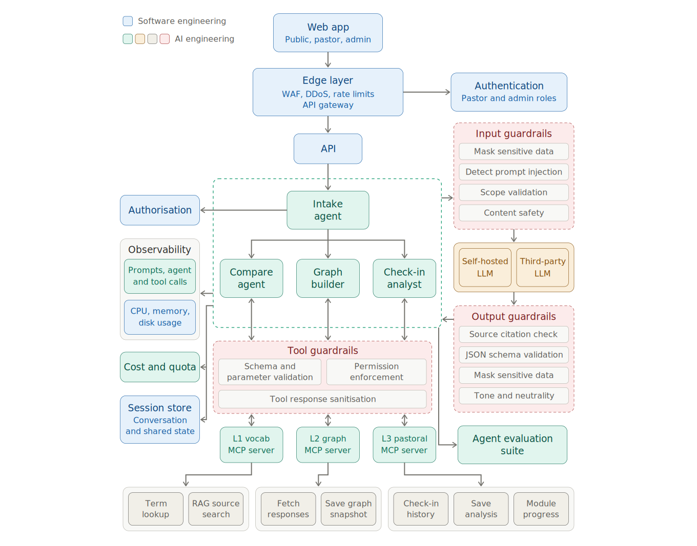
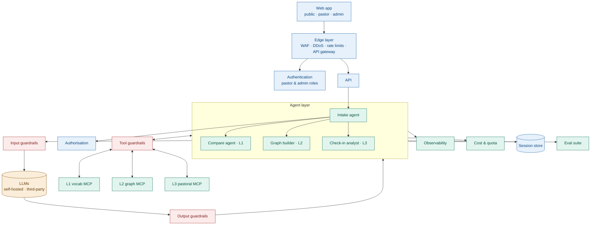

# Architecture

> Source of truth. Update in the same PR as any structural change. Colour key used in diagrams:
> **SWE** = software engineering components, **AI** = AI engineering components.

## Diagram

Editable/vector version: `architecture-diagram.svg`. Mermaid source below renders on GitHub.

## Tech stack

See `docs/adr/ADR-004-tech-stack.md` for the full decision, pinned models, and alternatives.

## Request lifecycle (L1 detailed mode example)

1. Web → Edge (WAF, rate limit) → API (`POST /api/l1/compare`).
2. API authenticates (optional for public), applies quota, calls **intake**. Because the route
   already implies L1, intake routes deterministically without an LLM call.
3. **Compare agent** calls `vocab.search_sources` via tool guardrails → gets source chunks (sanitised).
4. Compare agent calls `llm-gateway.complete` → input guardrails → model → output guardrails
   (schema, citation check, tone/neutrality, safety, refusal, advice, flourishing).
5. Validated JSON returned to the client; trace + cost recorded; lookup logged.

## Components

| Component | Class | Responsibility | Chosen (ADR-004) |
|---|---|---|---|
| Web app | SWE | Public, pastor, admin UIs | **Next.js (TypeScript)** on Vercel |
| Edge layer | SWE | WAF, DDoS, rate limits, TLS | **Cloudflare** |
| API | SWE | Routing, authn/z, validation, jobs | **FastAPI (Python)** on Railway/Render |
| Authentication | SWE | Identity, roles `public/pastor/admin` | **Supabase Auth** (JWT verified in FastAPI) |
| Authorisation | SWE | Role + ownership checks | In API + enforced again in MCP tools |
| LLM gateway | AI | Single entry to models; runs guardrail pipeline | Own package (`packages/llm-gateway`), Anthropic SDK |
| Intake agent | AI | Classify + route; never answers | Small/cheap model or deterministic |
| Compare agent | AI | L1 comparative explanations with citations | RAG over curated corpus |
| Graph builder | AI | L2 concept extraction → graph snapshot | Batch job |
| Check-in analyst | AI | L3 score, flags, encouragement, escalation | Self-hosted option for privacy |
| Input/Output/Tool guardrails | AI | See `guardrails.md` | Presidio, moderation model, injection classifier, Pydantic |
| MCP servers (3) | AI | Data access for agents via tools | Official MCP Python SDK |
| Relational DB | SWE | Users, lookups, modules, check-ins | **Postgres + pgvector** (Supabase) |
| Graph DB | SWE | L2 concept graph snapshots | **Memgraph** |
| Session store | SWE | Conversation + inter-agent state, rate-limit counters | **Redis** |
| Observability | AI+SWE | Traces, prompts, tool calls, cost; infra metrics | **Langfuse cloud** + OpenTelemetry |
| Cost & quota | AI | Per-request token caps, per-user daily quota, monthly budget | Gateway + Redis counters |
| Eval suite | AI | Offline + CI evals, red-team | `evals/` + Langfuse datasets |

## Agents

| Agent | Tools (allowlist) | Output schema | Model tier |
|---|---|---|---|
| intake | none | `schemas/intake.output.json` | small |
| compare | `vocab.lookup_term`, `vocab.search_sources` | `schemas/compare.output.json` | mid |
| graph-builder | `graph.fetch_responses`, `graph.get_previous_snapshot`, `graph.save_graph_snapshot` | `schemas/graph.output.json` | mid |
| checkin-analyst | `pastoral.get_checkin_history`, `pastoral.save_analysis`, `pastoral.get_module_progress` | `schemas/checkin.output.json` | mid / self-hosted |

## MCP servers

| Server | Tool | Mode | Role | Data class |
|---|---|---|---|---|
| vocab | `lookup_term(term)` | read | public | PUBLIC |
| vocab | `search_sources(query, traditions[], k≤8)` | read | public | PUBLIC |
| graph | `fetch_responses(question_id, month, limit)` | read | system/admin | COMMUNITY |
| graph | `get_previous_snapshot(question_id)` | read | system/admin | COMMUNITY |
| graph | `save_graph_snapshot(question_id, month, graph, idempotency_key)` | write | system | COMMUNITY |
| pastoral | `get_checkin_history(pastor_id, days≤14)` | read | pastor(self)/admin/system | PRIVATE |
| pastoral | `save_analysis(checkin_id, analysis, idempotency_key)` | write | system | PRIVATE |
| pastoral | `get_module_progress(pastor_id)` | read | pastor(self)/admin | PRIVATE |

## Which paths call a model

Intake routes by the URL and does not call a model (ADR-002). Every model call goes through `packages/llm-gateway` (ADR-001). There is no runtime picker and no auto-router across providers.

| Path | Model |
|---|---|
| Dictionary and Faith read | No. Faith copy still follows principle 7, because a person writes it. |
| Map, monthly question, draft, alerts, church registration | No |
| Compare, once that slice exists | Yes. Gateway only, then the seven-principle check. |
| Graph builder batch, once that slice exists | Yes. Gateway only. It extracts concepts. It does not coach. |
| Monday packet | Yes. One call. Gateway only. Gloo guarded mode when credentials exist, then the seven-principle check. |

A path not in this table does not call a model.

## Flourishing principles

Every model-written reply is written against these seven principles and checked on the way out (`OUT-FLOURISH` in `docs/guardrails.md`). The gateway asks whether each principle is relevant. If it is, the reply must help that part of life or leave it alone. It must not harm it. These are checks, not scores. They are not stored on the pastor, and the pastor view never shows a 0–100 or a geometric mean (ADR-005).

1. **Character and virtue.** Encourage doing good and waiting when that helps. Do not push a shortcut that hides a hard note.
2. **Close relationships.** Point toward a real person. Do not isolate the pastor or replace a person with the app.
3. **Happiness and life satisfaction.** Encouragement may steady the week. It does not rate mood, and it does not chase a streak.
4. **Meaning and purpose.** The reply may name why the work matters. It does not invent a calling.
5. **Mental and physical health.** A hard note is held for a person. The reply does not diagnose or give medical advice. The pastor sees "A person will see this."
6. **Financial and material stability.** A giving row stays a month total. The reply does not tell anyone how to spend, save, or give.
7. **Faith and spirituality.** A likeness is not identity. A source is required, or the line says the lexicon does not cover it. The two gaps stay the Christian bridge: a person who remains, against nirvana or moksha as the loss of personhood; and sin that needs a Savior, against ignorance fixed by teaching alone.

On all seven: think past this week, say when a source is thin, point to a real person when the reply touches health or money, and explain a refusal with a next step. A crisis is never a silent block (`IN-SAFE`).

## Out of scope for the AI/web version

Android offline app and sync — designed later; the API contract reserves `/api/sync/*`.
A flourishing score, a geometric mean, and an LLM judge on a dictionary read are out of scope. The seven principles are checks inside the gateway, not a separate product.
