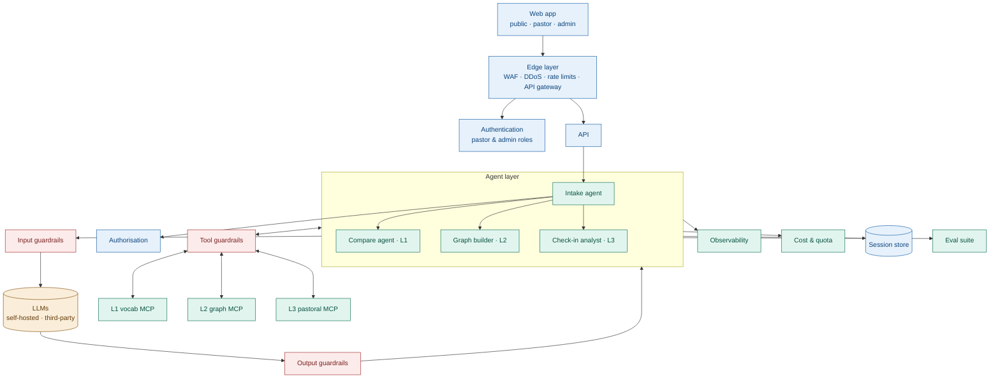

# Architecture

> Source of truth. Update in the same PR as any structural change. Colour key used in diagrams:
> **SWE** = software engineering components, **AI** = AI engineering components.

## Diagram

Editable/vector version: `architecture-diagram.svg`. Mermaid source below renders on GitHub.

## Tech stack

See `docs/adr/ADR-004-tech-stack.md` for the full decision, pinned models, and alternatives.

## Request lifecycle (L1 detailed mode example)

1. Web → Edge (WAF, rate limit) → API (`POST /api/l1/compare`).
2. API authenticates (optional for public), applies quota, calls **intake**. Because the route
   already implies L1, intake routes deterministically without an LLM call.
3. **Compare agent** calls `vocab.search_sources` via tool guardrails → gets source chunks (sanitised).
4. Compare agent calls `llm-gateway.complete` → input guardrails → model → output guardrails
   (schema, citation check, tone/neutrality, safety).
5. Validated JSON returned to the client; trace + cost recorded; lookup logged.

## Components

| Component | Class | Responsibility | Chosen (ADR-004) |
|---|---|---|---|
| Web app | SWE | Public, pastor, admin UIs | **Next.js (TypeScript)** on Vercel |
| Edge layer | SWE | WAF, DDoS, rate limits, TLS | **Cloudflare** |
| API | SWE | Routing, authn/z, validation, jobs | **FastAPI (Python)** on Railway/Render |
| Authentication | SWE | Identity, roles `public/pastor/admin` | **Supabase Auth** (JWT verified in FastAPI) |
| Authorisation | SWE | Role + ownership checks | In API + enforced again in MCP tools |
| LLM gateway | AI | Single entry to models; runs guardrail pipeline | Own package (`packages/llm-gateway`), Anthropic SDK |
| Intake agent | AI | Classify + route; never answers | Small/cheap model or deterministic |
| Compare agent | AI | L1 comparative explanations with citations | RAG over curated corpus |
| Graph builder | AI | L2 concept extraction → graph snapshot | Batch job |
| Check-in analyst | AI | L3 score, flags, encouragement, escalation | Self-hosted option for privacy |
| Input/Output/Tool guardrails | AI | See `guardrails.md` | Presidio, moderation model, injection classifier, Pydantic |
| MCP servers (3) | AI | Data access for agents via tools | Official MCP Python SDK |
| Relational DB | SWE | Users, lookups, modules, check-ins | **Postgres + pgvector** (Supabase) |
| Graph DB | SWE | L2 concept graph snapshots | **Memgraph** |
| Session store | SWE | Conversation + inter-agent state, rate-limit counters | **Redis** |
| Observability | AI+SWE | Traces, prompts, tool calls, cost; infra metrics | **Langfuse cloud** + OpenTelemetry |
| Cost & quota | AI | Per-request token caps, per-user daily quota, monthly budget | Gateway + Redis counters |
| Eval suite | AI | Offline + CI evals, red-team | `evals/` + Langfuse datasets |

## Agents

| Agent | Tools (allowlist) | Output schema | Model tier |
|---|---|---|---|
| intake | none | `schemas/intake.output.json` | small |
| compare | `vocab.lookup_term`, `vocab.search_sources` | `schemas/compare.output.json` | mid |
| graph-builder | `graph.fetch_responses`, `graph.get_previous_snapshot`, `graph.save_graph_snapshot` | `schemas/graph.output.json` | mid |
| checkin-analyst | `pastoral.get_checkin_history`, `pastoral.save_analysis`, `pastoral.get_module_progress` | `schemas/checkin.output.json` | mid / self-hosted |

## MCP servers

| Server | Tool | Mode | Role | Data class |
|---|---|---|---|---|
| vocab | `lookup_term(term)` | read | public | PUBLIC |
| vocab | `search_sources(query, traditions[], k≤8)` | read | public | PUBLIC |
| graph | `fetch_responses(question_id, month, limit)` | read | system/admin | COMMUNITY |
| graph | `get_previous_snapshot(question_id)` | read | system/admin | COMMUNITY |
| graph | `save_graph_snapshot(question_id, month, graph, idempotency_key)` | write | system | COMMUNITY |
| pastoral | `get_checkin_history(pastor_id, days≤14)` | read | pastor(self)/admin/system | PRIVATE |
| pastoral | `save_analysis(checkin_id, analysis, idempotency_key)` | write | system | PRIVATE |
| pastoral | `get_module_progress(pastor_id)` | read | pastor(self)/admin | PRIVATE |

## Out of scope for the AI/web version

Android offline app and sync — designed later; the API contract reserves `/api/sync/*`.
