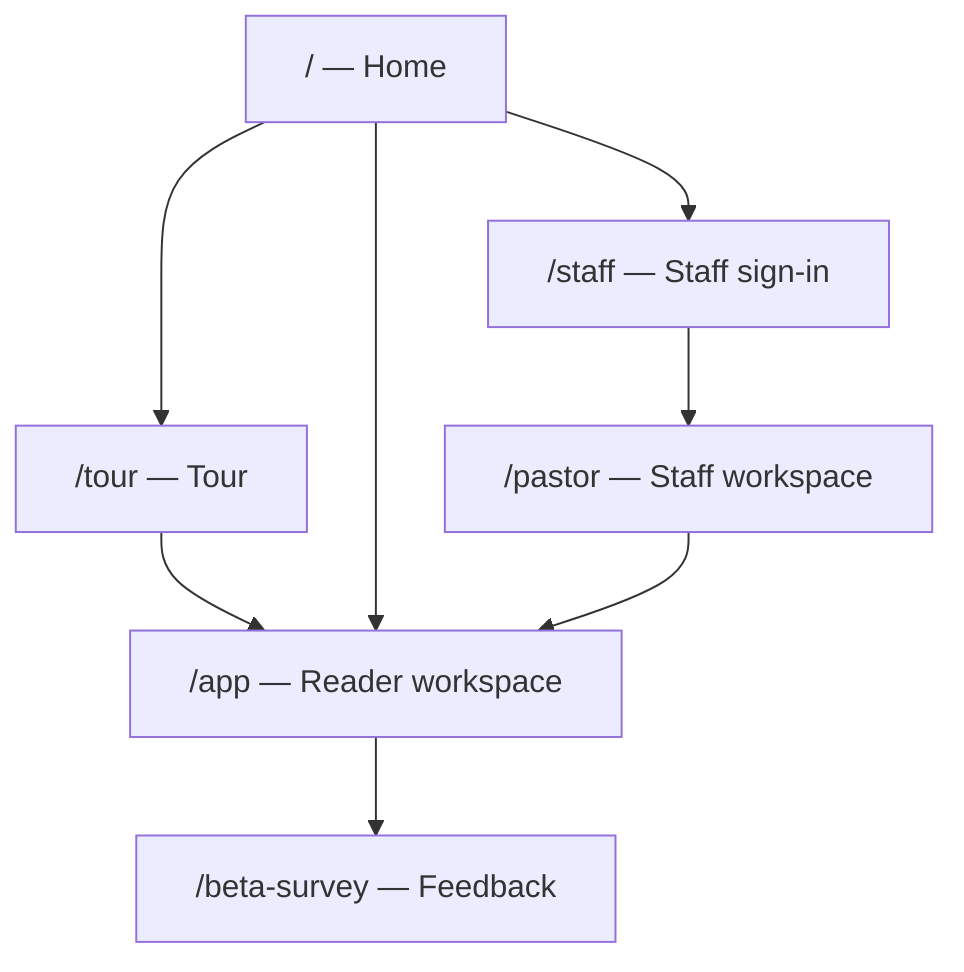

# Rhema.ai — user manual (every layer)

**One software:** https://rhema-ai-web.vercel.app  
**Help in browser:** https://rhema-ai-web.vercel.app/help  

This document is the full map of **who uses what**, **which URL to open**, **what you can do**, and **hidden layers** (admin, demo, offline, QA).

---

## 0. Before you start

| Rule | Detail |
|------|--------|
| One host | Always **rhema-ai-web** — not the API subdomain |
| Two audiences | **Readers** (public) vs **Staff** (invited codes) — different entry, same brand |
| Data | Live beta saves to **Postgres** when Database is **up** on `/api/v1/status` |
| Privacy | We map **ideas**, not people; pseudonyms in UI; pastor notes encrypted at rest |

---

## 1. Layer map (product architecture)

| Layer | Name | Where in app | What it does |
|-------|------|--------------|--------------|
| **L0** | Home & tour | `/`, `/tour` | Explain product; funnel to Reader or Staff |
| **L1** | Reader / dictionary | `/app` | Words, Faith mode, sources, settings |
| **L2** | Community (inside Reader) | `/app#r=month`, `#r=graph` | Anonymous monthly answers → idea counts → map |
| **L3** | Staff pipeline | `/pastor` | Pastor check-in, tracks, packs, church apps, review, alerts |
| **—** | Beta feedback | `/beta-survey` | Survey to team (not in Reader nav) |
| **Hidden** | Admin | `/app#r=admin` after **A-0100** | Accounts, map draft, faith review, beta CSV |
| **Hidden** | Expert | Faith mode on a word | Suggest edits (pending human review) |
| **Hidden** | QA / demo | `#api=0`, `/screens` | Design & CI only |

---

## 2. Reader path (public — no staff code)

### 2.1 Recommended first visit

1. Open **/**  
2. **Get started** → **/tour?from=landing**  
3. **Continue into the public app** → onboarding (`#r=intro`)  
4. Use **Dictionary**, **This month**, **Map** from the bottom or top nav  

**Skip tour:** tour bar **Skip — try the dictionary** or open **/dictionary**.

### 2.2 Without any account (guest)

| Action | How |
|--------|-----|
| Search a word | Home search box or `/app#guest=1&r=search` |
| Open a term | Tap a result → `#r=term&t=karma` |
| Faith mode | Press and hold the headword (parallel traditions) |
| Monthly question | Nav **This month** → `#r=month` → answer (moderated) |
| Ideas map | Nav **Map** → `#r=graph` |
| Settings / privacy | Gear icon → `#r=settings` |
| Beta survey | Home band or **/beta-survey** |

**Guest limits:** no saved account email; session cookie for API when live.

### 2.3 With email account (member)

| Action | How |
|--------|-----|
| Create account | **Sign in** on home → **Create account** tab |
| Return visit | **Sign in** with email + password |
| Upgrade from guest | Sign in flow while guest session exists |

Display name in UI is a **pseudonym** (e.g. `U-A3F2`), not your email.

### 2.4 Reader — what is stored (live API)

| You do | Server (when DB up) |
|--------|---------------------|
| Search / open term | Read lexicon; optional lookup log (no PII) |
| Submit monthly answer | Redacted text + salted device hash per month |
| Sign up | Account + scrypt password hash |
| Onboarding complete | `PUT /me/onboarding` |
| Change settings | `PUT /me/preferences` |
| Delete me | `DELETE /me` |

**Errors:** blocked injection → nothing saved; gibberish → validation message; rate limit → try again.

---

## 3. Staff path (Layer 3 — invited)

### 3.1 Entry (always start here on live)

| Method | URL |
|--------|-----|
| **Have org code** | **/staff** → **I have a code** → e.g. `P-0233` + password from organizer |
| **Phone demo (hackathon)** | **/staff?register=phone** → number → **Send code** → code on screen → password → new `P-xxxx` |

After sign-in the app sends you to **/pastor** (not back to tour).

| Role (demo codes) | Lands on |
|-------------------|----------|
| Pastor `P-0233`, `P-0901` | Tracks / home flow |
| Leader `L-0100` | `#r=alerts` |
| Reviewer `R-0100` | `#role=reviewer&r=queue` |

### 3.2 Pastor workspace (`/pastor`)

| Screen | Route | Typical actions |
|--------|-------|-----------------|
| Home | `#r=home` | Season ring, mentor note, start check-in |
| Check-in | `#r=checkin` | Consent → mood, prayer, visits, struggles/wins → send |
| Result | `#r=result` | Steady / held for person / retry / offline queued |
| Three tracks | `#r=tracks` | Development, community, giving overview |
| Monthly pack | `#r=pack` | Report, feedback, evidence list |
| Church apps | `#r=integrations` | Connect Planning Center (demo) |
| Register church | `#r=register` | Join code |
| **Public dictionary** | Sidebar link | Opens Reader as guest — same product, other workspace |

### 3.3 Reviewer (`#role=reviewer`)

| Step | Action |
|------|--------|
| Queue | `#r=queue` — open a pack |
| Review | `#r=review&id=…` — acknowledge, read agent summary, **decision** (continue / plan / additional review) |

Decisions call API when live; errors roll back optimistic UI.

### 3.4 Leader (`#role=leader` or pastor with leader cap)

| Screen | `#r=alerts` |
|--------|-------------|
| Raise / confirm regional alert | Typed confirmation; affects public **lockdown** (month/map hidden) |

### 3.5 Staff sign-out

Sign out → returns to **Reader** search as guest/sign-in — still same host.

---

## 4. Beta feedback layer

| Step | URL |
|------|-----|
| Open form | **/beta-survey** |
| Submit | ~1 minute; optional fields; rate limited |
| Team reads | Admin **Beta feedback** or CSV export |

API: `POST /api/v1/feedback/beta-survey`

---

## 5. Hidden layers (not in main nav)

### 5.1 Admin (`A-0100` only — never public posts)

| Task | After sign-in |
|------|----------------|
| Beta survey summary + CSV | `/app#r=admin&tab=feedback` |
| Accounts, invite, suspend | `#r=admin&tab=accounts` |
| Map draft publish/dismiss | `#r=admin&tab=map` / `#r=admin&tab=draftmap` |
| Faith review queue | `#r=admin&tab=edits` |

Hash-only `#as=admin` without session shows **Admins only** — expected.

### 5.2 Expert / Faith edits

On a word → hold headword → Faith mode → expert tools suggest changes → **pending two human reviewers** before public.

### 5.3 Guardrail & safety behaviors (all layers)

| Trigger | What you see |
|---------|----------------|
| Prompt injection in free text | Blocked; nothing saved |
| Crisis language (check-in / month) | Held for a person; supportive copy |
| PII in public fields | Redacted server-side where policy applies |
| Regional alert active | Reader month/map may hide (**lockdown**) |
| Offline | Cached words; check-in may **queue** until online |
| Escape (from word screen) | **Plain page** — minimal HTML, privacy |

### 5.4 Demo & QA (developers / judges)

| Tool | URL |
|------|-----|
| All screens grid | `/screens` |
| Smoke manifest | `design/ui_kits/screens-manifest.json` (45 screens) |
| Live API off | `#api=0` on pastor URLs — fixture `CA_PIPE` |
| Demo boards iframe | `data-ca-demo` / Full Demo HTML |

---

## 6. Operations matrix (live beta — honest)

**Legend:** ✅ Live API + persist · 🟡 Partial / fixture fallback · 🔴 UI only / not wired

### Reader (`/app`)

| Feature | View | Create | Update | Delete | Errors |
|---------|------|--------|--------|--------|--------|
| Dictionary | ✅ | — | — | — | ✅ |
| Monthly answer | ✅ | ✅ | replace same month | — | ✅ |
| Map | ✅ | — | — | — | 🟡 |
| Guest / member auth | ✅ | ✅ | — | ✅ delete-me | ✅ |
| Onboarding | ✅ | ✅ | ✅ | — | 🟡 |
| Expert edits | ✅ | 🟡 | — | — | 🟡 |
| Admin tabs | ✅ | 🟡 invite | 🟡 | — | ✅ |

### Staff (`/pastor`)

| Feature | View | Create | Update | Delete | Errors |
|---------|------|--------|--------|--------|--------|
| Check-in | ✅ | ✅ | retry | — | ✅ |
| Review ack/decide | ✅ | ✅ | — | — | 🟡 |
| Alerts | ✅ | 🟡 | 🟡 | — | 🟡 |
| Tracks / pack / PCO | 🟡 | 🟡 | — | — | 🟡 |
| Phone register | ✅ | ✅ | — | — | ✅ |

Full engineering map: `contract/screens.md` · API: `contract/api.md`.

---

## 7. File & route reference (for builders)

| User sees | File on disk |
|-----------|----------------|
| `/` | `design/ui_kits/landing/Landing.jsx` |
| `/tour` | `design/ui_kits/tour/` |
| `/app` | `design/ui_kits/public/index.html` + `*.jsx` |
| `/pastor` | `design/ui_kits/pipeline/index.html` + `*.jsx` |
| `/beta-survey` | `design/ui_kits/beta-survey.html` |
| `/staff` | `staff.html` → `#r=signin&staff=l3` |
| API | `apps/api` → `/api/v1/*` via Next proxy |

Hash routes (`#r=…`) keep one path per workspace so sharing links stays stable.

---

## 8. Quick personas

| I am… | Open | Then |
|-------|------|------|
| Curious visitor | `/` | Tour → Reader guest |
| Regular reader | `/app` | Sign in or guest |
| Beta tester | `/` + `/beta-survey` | Tour optional |
| Pastor (invited) | `/staff` | Code + password → `/pastor` |
| Reviewer | `/staff` | `R-0100` → queue |
| Leader | `/staff` | `L-0100` → alerts |
| Product owner | `/staff` as **A-0100** | Admin → beta CSV |

---

## 9. Related docs

| Doc | Content |
|-----|---------|
| [canonical-urls.md](./canonical-urls.md) | URL cheat sheet |
| [screen-flow.md](./screen-flow.md) | Short public vs staff paths |
| [beta-pastor-invite.md](./beta-pastor-invite.md) | Staff invite pack |
| [HACKATHON.md](./HACKATHON.md) | Security, testing, deploy |
| [contract/screens.md](../contract/screens.md) | Screen → API matrix |

*Last updated: unified product manual + staff phone demo.*
